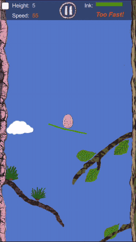
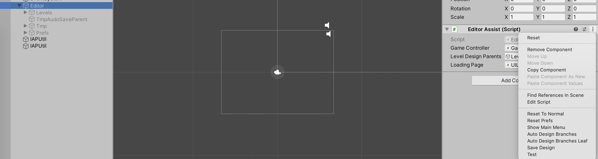

# Aero Egg

A 2D Indie Game Based on Unity3D.



<video id="video" controls="" preload="none">
<source id="mp4" src="./screenrecord/height-655.mp4" type="video/mp4">
</video>

## Download
### [IOS App Store](https://itunes.apple.com/us/app/volitant-egg-ads-version/id1247264387?mt=8)

### [Android English](https://blog.kazge.com/show/volitantegg/AreoEgg.apk)

### [安卓 - 中文](https://blog.kazge.com/show/volitantegg/%E9%A3%9E%E7%BF%94%E7%9A%84%E9%B8%A1%E8%9B%8B.apk)

### Features
- Dynamic load/unload level, the whole not small game is in a same Unity Scene.
- Visual edit game scene in the Unity Editor by Unity Editor script.  

## File Structure
### art 
This folder contains the arts design files(Adobe Photoshop,Adobe Illustrator) which made by myself. and the scripts for Photoshop and Illustrator.

Normally, most players appear in the game is designed by Photoshop while icon and background was using Illustrator.

### doc
This folder contains the files of the document of this project.

### screenrecord
Contains the video of the game.
### src
Contain the code of the android version.

## Development
Require Unity 2019.3.0f6 or above.

This project is target to Android only, but it is easy to convert to IOS.

Use the unity to open the folder src/VolitantEgg.

You could use a emulator(such as [mumu](http://mumu.163.com/)) or android device to run the built apk file.

## Art
### Animation

### Export via script
`art/ai.jsx` is the script for Illustrator. 
``` javascript
// you have to change the path to the folder on your local machine
var G_desFolder = '<your path>/SaveTheEgg/src/SaveTheEgg/Assets/Resources/Img';
```
`art/ps.jsx` is the script for Photoshop. 
``` javascript
// you have to change the path to the folder on your local machine
var saveFolder = "<your path>/SaveTheEgg/src/VolitantEgg/Assets/Resources/Img";
```
You could use this script 
to export the layers as separate image.

## Edit the Level  
`src/VolitantEgg/Assets/Scripts/ste/EditorAssist.cs` contain the editor assist code to deign, save the levels.


When need to edit the level, make the `Editor` Object visible, you will see the branches of the trees, animals players and other stuff of all the levels.

You could adjust the level position, add object etc... then save the levels (by click the `Save Design` menu button) to prefabs as the levels are loaded dynamically via the [Unity Prefabs](https://docs.unity3d.com/Manual/Prefabs.html). 

## Single Scene with all the levels dynamically loading
The game have many logic levels, normally it depends on the height the egg fly to. The more the egg near the ground, the more the `height` be, it will be more hard as there are more animals `dangerous` to the Egg.

There are only one [Unity Scence](https://docs.unity3d.com/Manual/CreatingScenes.html), so there are no interruption between the levels, player have to keep the `Egg` `safe`.

Script `src/VolitantEgg/Assets/Scripts/kazgame/level/DanymicLoadLevelController.cs` abstract a mechanism that able to dynamically load Unity Prefabs. Simply, it check the `main camera` `y` value and the nearest level `y`, if smaller than the giving value, start to load the Prefabs in the background asynchronously. and unload the levels loaded but off the screen.

### Two Trees
There are two trees in the game, left is a pine tree, right is a oak tree(I hope I draw them correctly. :smile:). 

